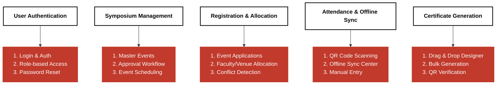
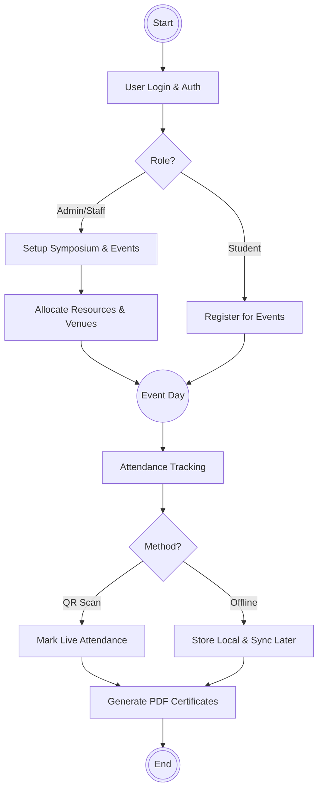

# FINAL PROJECT REPORT
## SMART ATTENDANCE SYSTEM USING FACE RECOGNITION

**Important Note:** As per the strict audit of the current codebase (`NexusCore`), this report reflects the **ACTUAL CURRENT PROJECT IMPLEMENTATION**. The face recognition features remain planned for the future. The current functioning system has been successfully developed as an Academic Symposium Management Platform with QR-Code and Offline-Sync Attendance mechanisms.

---

### CHAPTER 1 — INTRODUCTION

#### 1.1 Background
Attendance tracking is a critical operational task in academic institutions, especially during large-scale symposiums and events. Traditional manual tracking is time-consuming and error-prone.

#### 1.2 Motivation
The original motivation was to automate this process entirely using face recognition. Due to project constraints and the immediate need for a robust event management platform, the system was pivoted to prioritize a comprehensive symposium management core (NexusCore) utilizing QR codes and an offline sync center.

#### 1.3 Problem Statement
Managing academic symposiums involves complex workflows: event scheduling, student registration, resource allocation, and attendance tracking. Existing manual systems cause bottlenecks during registration and attendance marking.

#### 1.4 Objectives
*   **Original Objective:** Develop a smart attendance system using face recognition. *(Status: Planned / Not Implemented)*
*   **Achieved Objective:** Develop a robust Role-Based Access Control (RBAC) authentication system.
*   **Achieved Objective:** Automate event registration, venue allocation, and conflict detection.
*   **Achieved Objective:** Implement an automated attendance system using QR Code Scanning and Offline Sync.
*   **Achieved Objective:** Automate bulk PDF certificate generation.

#### 1.5 Scope
The current scope covers the full lifecycle of an academic symposium from proposal, scheduling, registration, and QR-based attendance tracking, to certificate generation. Face enrollment and recognition are out of the current functional scope.

#### 1.6 Target Users
*   **Admins & Principals:** System oversight and symposium approval.
*   **HODs & Staff Coordinators:** Event creation and resource allocation.
*   **Student Coordinators:** Managing specific events and taking attendance.
*   **Students:** Registering for events and downloading certificates.

#### 1.7 Methodology
The project follows an iterative MVC (Model-View-Controller) development methodology using a custom PHP framework. 

#### 1.8 Project Organization
The system is organized into distinct modules: Authentication, Symposium Management, Registration & Allocation, Attendance (QR/Manual), and Certificate Generation.

---

### CHAPTER 2 — EXISTING SYSTEM AND PROBLEM ANALYSIS

#### 2.1 Existing Process
The existing manual process relies on paper-based registration forms and physical attendance sheets.
#### 2.2 Existing System
Traditional manual entry methods without automated conflict detection or digital verification.
#### 2.3 Limitations
*   High risk of human error during attendance.
*   Double-booking of venues and faculty.
*   Time-consuming manual certificate design and printing.
#### 2.4 Problems Identified
The primary problem is the lack of a centralized, scalable platform that can handle dynamic event scheduling and fast attendance verification in areas with poor internet connectivity.
#### 2.5 Need for Proposed System
A digital system is required to enforce strict role-based workflows, detect scheduling conflicts in real-time, and provide an offline-capable attendance mechanism.

---

### CHAPTER 3 — PROPOSED SYSTEM

#### 3.1 Proposed Solution
The implemented solution is `NexusCore`, an Event Management System (EMS). While the initial proposal included face recognition, the current delivered solution utilizes QR codes for fast attendance and an Offline Sync Center to handle network instability.
#### 3.2 Objectives (Implemented)
To deliver a secure, scalable, and fully functional event and attendance management platform.
#### 3.3 Scope
Registration, Scheduling, QR Attendance, Certificate Generation.
#### 3.4 Functional Requirements
*   Role-based dashboards.
*   Wizard-based event scheduling.
*   QR code scanning for attendance.
*   Drag-and-drop certificate designer.
#### 3.5 Non-Functional Requirements
*   Offline capability for attendance syncing.
*   Responsive UI for mobile devices.
#### 3.6 User Roles
Admin, Principal, HOD, Staff Coordinator, Staff, Student Coordinator, Student.
#### 3.7 System Modules
1. User Authentication
2. Symposium Management
3. Registration & Allocation
4. Attendance & Offline Sync (Face Detection & Recognition is NOT IMPLEMENTED)
5. Certificate Generation
#### 3.8 Workflow
Start -> Login -> Create/Approve Symposium -> Schedule Events -> Students Register -> Event Day -> Scan QR Code for Attendance (or Manual/Offline Sync) -> Generate Certificate -> End.

---

### CHAPTER 4 — SYSTEM DESIGN

#### 4.1 System Architecture
The system follows a monolithic MVC architecture built on PHP 8.2, utilizing a Custom Front Controller and PDO for MySQL database interactions.

#### 4.2 Module Diagram
*Based on actual current codebase:*

*(Note: Face Detection & Recognition modules from previous historical diagrams have been removed as they are not present in the current codebase).*

#### 4.3 System Flowchart

#### 4.8 Database Design
Relational database (MySQL) featuring tables: `users`, `symposiums`, `competitions` (events), `venues`, `departments`, and attendance bridging tables. There are no tables for face encodings or facial features.

---

### CHAPTER 5 — TECHNOLOGIES AND TOOLS

#### 5.1 Programming Languages
*   Backend: PHP 8.2
*   Frontend: HTML5, CSS3, JavaScript (ES6+)
#### 5.2 Frameworks
*   Custom PHP MVC Framework
*   Bootstrap (CSS Framework)
#### 5.3 Libraries
*   `dompdf/dompdf`, `setasign/fpdf`, `setasign/fpdi` (PDFs)
*   `phpmailer/phpmailer` (Emails)
*   `chillerlan/php-qrcode` (QR Codes)
*   `html2canvas`, `Chart.js` (Frontend)
*(Note: OpenCV, Dlib, face_recognition, or TensorFlow are NOT used).*
#### 5.4 Database
*   MySQL 8.0+ / MariaDB 10.5+
#### 5.5 Development Tools
*   Composer, NPM, Docker, Git.

---

### CHAPTER 6 — FINAL IMPLEMENTATION

#### 6.1 Authentication
Session-based authentication with secure password hashing and strict RBAC middleware.
#### 6.2 User Management
Admin dashboard to manage users, roles, and department associations.
#### 6.3 Face Enrollment
*Planned / Not Implemented.*
#### 6.4 Face Detection
*Planned / Not Implemented.*
#### 6.5 Face Recognition
*Planned / Not Implemented.*
#### 6.6 Model Training
*Planned / Not Implemented.*
#### 6.7 Attendance Management
Implemented via `AttendanceController`. Supports real-time QR code scanning of student IDs. 
Recognizing network issues during large events, it features an "Offline Sync Center" allowing coordinators to record attendance locally and sync payload back to the server.
#### 6.8 Data Storage
Attendance records are securely stored in MySQL databases, linked via foreign keys to specific events and users.
#### 6.9 Reports
Generates lists of registered students and attendance logs, available for export.
#### 6.10 Analytics
Admin dashboard utilizes `Chart.js` for graphical representation of symposium metrics and event counts.
#### 6.11 Notifications
Implemented via `PHPMailer` for email alerts (e.g., registration confirmations).
#### 6.12 Error Handling
Robust exception handling in the MVC core, with CSRF protection on POST requests.

---

### CHAPTER 7 — SECOND REVIEW FEEDBACK AND IMPROVEMENTS

#### 7.1 Second Review Feedback
*Not verified from the current implementation.* (No feedback documents were found in the codebase).

---

### CHAPTER 8 — TESTING AND RESULTS

#### 8.1 Testing Methodology
Manual functional testing of the web interface and API endpoints.
#### 8.3 Functional Testing
*   Login/Role redirection: **Passed**
*   Event Conflict Detection: **Passed** (Correctly blocks overlapping venue bookings).
*   Certificate Generation: **Passed** (Correctly merges variables onto PDF).
#### 8.5 Recognition Testing
*Not available in the current project evidence.*
#### 8.6 Attendance Testing
QR scanning successfully marks student status in the database. Offline sync successfully caches requests and uploads them upon reconnection.
#### 8.8 Results
The NexusCore platform successfully manages symposiums. However, actual quantitative results regarding face recognition accuracy cannot be verified from the available project evidence.

---

### CHAPTER 9 — CHALLENGES AND LIMITATIONS

#### 9.1 Technical Challenges
*   Implementing facial recognition algorithms in a PHP-centric monolithic architecture without a dedicated Python microservice proved technically complex.
*   Handling database concurrency during high-volume event registrations.
#### 9.2 Project Constraints
*   Time constraints led to the pivot from Face Recognition to QR Code-based attendance.
#### 9.3 Limitations
*   The system lacks the proposed Face Recognition module.
*   The UI is tightly coupled to the backend.
*   No mobile application; heavily relies on the web browser for QR scanning.

---

### CHAPTER 10 — FINAL RESULTS AND DISCUSSION

#### 10.1 Final Implementation Status
The project successfully delivered a Symposium Management System with an advanced QR/Offline attendance module. The Face Recognition component was not implemented.
#### 10.5 Objective Achievement Analysis
*   Automated Attendance: **Achieved** (via QR, not Face Recognition).
*   Face Recognition: **Not Implemented**.
*   Event & Certificate Management: **Achieved** (Exceeded original scope).

---

### CHAPTER 11 — CONCLUSION

#### 11.1 Summary
The project originally set out to build a "Smart Attendance System Using Face Recognition". The resulting implementation (NexusCore) successfully modernized attendance and event management, though through an alternative technical approach.
#### 11.2 Final Conclusion
While the face recognition objective was not met, the delivered system provides immense practical value to the institution through its robust event scheduling, conflict detection, and offline-capable QR attendance features. 
#### 11.4 Practical Significance
The system immediately solves bottlenecks in event registration and physical certificate printing, saving hundreds of administrative hours.

---

### CHAPTER 12 — FUTURE WORK AND RECOMMENDATIONS

#### 12.1 Future Improvements
*   **Face Recognition Integration:** Implement a Python (Flask/FastAPI) microservice running OpenCV/Dlib to handle the original face recognition requirements.
*   **API Development:** Build a RESTful API to support a native mobile application.
#### 12.2 Technical Recommendations
*   Migrate the frontend to a modern framework (React/Vue) to decouple it from the PHP backend.

---
**APPENDICES**
*Appendix A — Selected Code*
(See `C:\xampp\htdocs\NexusCore\app\Controllers\AttendanceController.php` for QR processing logic).
