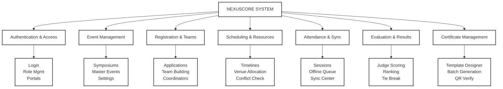
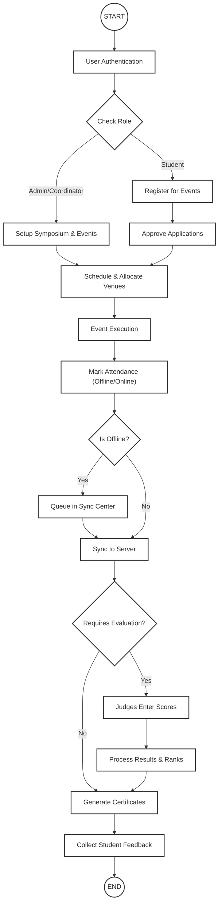
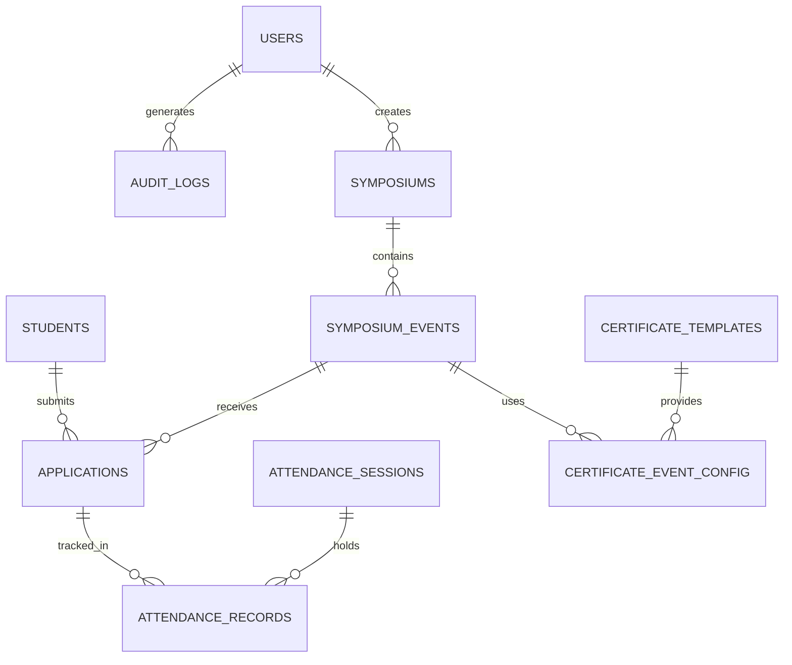

# FINAL MODULE AND WORKFLOW DIAGRAMS

## 1. Main Module Diagram

```mermaid
flowchart TD
    TITLE["NEXUSCORE SYSTEM"]
    
    TITLE --> M1["Authentication & Access"]
    TITLE --> M2["Event Management"]
    TITLE --> M3["Registration & Teams"]
    TITLE --> M4["Scheduling & Resources"]
    TITLE --> M5["Attendance & Sync"]
    TITLE --> M6["Evaluation & Results"]
    TITLE --> M7["Certificate Management"]
    
    M1 --> S1["Login<br>Role Mgmt<br>Portals"]
    M2 --> S2["Symposiums<br>Master Events<br>Settings"]
    M3 --> S3["Applications<br>Team Building<br>Coordinators"]
    M4 --> S4["Timelines<br>Venue Allocation<br>Conflict Check"]
    M5 --> S5["Sessions<br>Offline Queue<br>Sync Center"]
    M6 --> S6["Judge Scoring<br>Ranking<br>Tie Break"]
    M7 --> S7["Template Designer<br>Batch Generation<br>QR Verify"]
    
    classDef default fill:#fff,stroke:#333,stroke-width:2px;
```

## 2. System Flowchart

```mermaid
flowchart TD
    START((START)) --> AUTH["User Authentication"]
    AUTH --> ROLE{"Check Role"}
    
    ROLE -->|Admin/Coordinator| SETUP["Setup Symposium & Events"]
    ROLE -->|Student| REG["Register for Events"]
    
    SETUP --> SCHED["Schedule & Allocate Venues"]
    REG --> APP["Approve Applications"]
    APP --> SCHED
    
    SCHED --> EXEC["Event Execution"]
    EXEC --> ATT["Mark Attendance (Offline/Online)"]
    ATT --> SYNC{"Is Offline?"}
    SYNC -->|Yes| QUEUE["Queue in Sync Center"]
    QUEUE --> SERVER["Sync to Server"]
    SYNC -->|No| SERVER
    
    SERVER --> EVAL{"Requires Evaluation?"}
    EVAL -->|Yes| JUDGE["Judges Enter Scores"]
    JUDGE --> RES["Process Results & Ranks"]
    EVAL -->|No| CERT["Generate Certificates"]
    RES --> CERT
    
    CERT --> FEEDBACK["Collect Student Feedback"]
    FEEDBACK --> END((END))
    
    classDef default fill:#fff,stroke:#333,stroke-width:2px;
```

## 3. Database ER Overview (Simplified)

```mermaid
erDiagram
    USERS ||--o{ AUDIT_LOGS : generates
    USERS ||--o{ SYMPOSIUMS : creates
    SYMPOSIUMS ||--o{ SYMPOSIUM_EVENTS : contains
    STUDENTS ||--o{ APPLICATIONS : submits
    SYMPOSIUM_EVENTS ||--o{ APPLICATIONS : receives
    APPLICATIONS ||--o{ ATTENDANCE_RECORDS : tracked_in
    ATTENDANCE_SESSIONS ||--o{ ATTENDANCE_RECORDS : holds
    SYMPOSIUM_EVENTS ||--o{ CERTIFICATE_EVENT_CONFIG : uses
    CERTIFICATE_TEMPLATES ||--o{ CERTIFICATE_EVENT_CONFIG : provides
```
